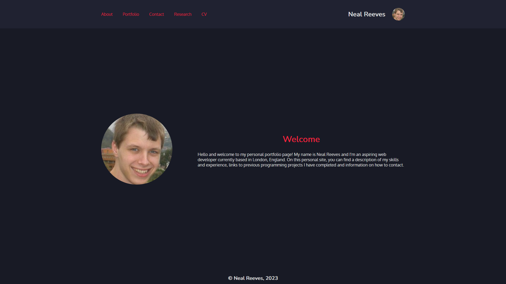

# Personal Portfolio in React

## Table of Contents
1. [URL](#url)
2. [Description](#description)
3. [Installation](#installation)
4. [Usage](#usage)
5. [Credits](#credits)

## URL 

A live version of this page has been deployed at
https://spacepineapple.github.io/react-portfolio/ .

## Description 

This portfolio site was created as my solution to the final challenge task of a
Front-End Web Development bootcamp. For this task, I was not provided with
starter code and given only basic guidelines on how the page should look. My
task was to build a personal portfolio site using React which conformed to the
following criteria:

1. The page needed to use React and React Router
2. The page needed to include my name and links to GitHub, LinkedIn and my email
   address
3. The page needed to include an up-to-date PDF of my CV
4. The page needed to include a list of coding projects I have completed
5. The page needed to render at least 6 components including:
    * App
    * Header
    * Home
    * Project Gallery
    * Project
    * Contact
6. The App component needed to be a top-level component which renders all
   necessary child components
7. The header needed to be rendered across the site and include a nav bar
8. The project gallery needed to be rendered dynamically and produce at least 6
   instances of the project component
9. The project component needed to be reusable and take in JSON data, using
   router props to render the correct project based on user selection including
   the project title, a link to the deployed version and GitHUB repository, as
   well as a screenshot or GIF.
10. The contact form needed contact information and a form for handling events
11. Finally, the Home page needed to serve as a welcome landing page with my
    name, a photo and a brand statement indicating that this is my personal portfolio.

The appearance of the landing page is as follows: 

## Installation 

No specific installation should be required for this application, which should
run in any modern browser. Note that the source code contained in the repository
requires certain packages including react, gh-pages and deploy as installed
through node.js. If a user wishes to run the code locally on their computer
rather than visiting the deployed page, they will need to install these packages
and npm.

## Usage 

This page can be used by visiting the URL listed above and viewing the page in
the browser. Note that the page requires Javascript to view. If downloading the
repository, the page can be rendered in the browser by navigating to the
repository using the command line or terminal and running "npm run start". Note
that as described under installation, this will require npm and other packages.

## Credits <a id="credits>"></a>

